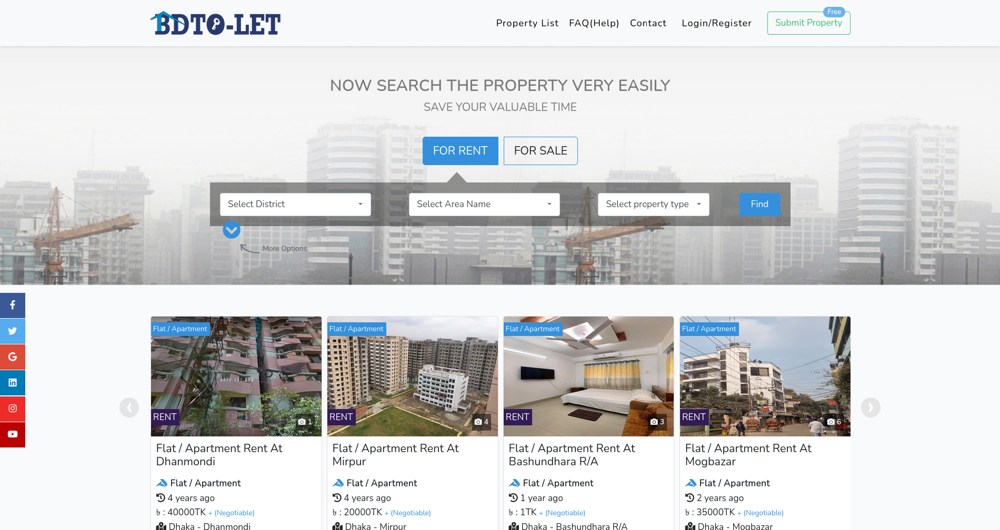

<p align="center">
  
  &nbsp;&nbsp;
  
</p>

<h1 align="center">LandLord &amp; BariVara</h1>

<p align="center">
  A two-sided rental ecosystem: a property-management console for landlords, and a public
  rental marketplace for tenants — sharing one backend platform and one data story.
</p>

<p align="center">
  
  
  
  
  
  
</p>

<p align="center">
  
</p>

---

## What this is

**LandLord** is the back-office app a property owner uses to run their rental business —
units, tenants, rent collection, maintenance, ads, and reports. **BariVara** is the public
site a renter uses to browse listings and message landlords. Both are real, independent
Angular applications with their own Spring Boot backend, but they're deliberately kept in
narrative sync: a unit made vacant in LandLord is the same unit that appears as a live ad on
BariVara.

This is a personal, from-scratch build — both the product design and every line of code —
used as a learning project for full-stack development, not a fork or template.

## Features

**Landlord console**
- Dashboard with real KPIs — occupancy, collections, outstanding rent, net income, pending maintenance
- Property & unit management, with inline accordion unit lists
- Tenant management — move-in/move-out lifecycle, searchable tenant lookup
- Rent collection, payment history, and auto-generated PDF receipts
- Maintenance ticket tracking
- Marketplace ad management, synced with BariVara listings
- Exportable reports (PDF / Excel) and free-tier AI-generated portfolio insights
- Automated reminders — rent due, ad expiry, monthly bill catch-up
- Account settings — profile, security, appearance, notification preferences

**BariVara marketplace**
- Public listing browse and search
- Landlord-linked account, mirroring the same units in real time
- Forgot-password / OTP email flow wired to a real transactional mail provider

**Shared platform**
- Real authentication — JWT-based login, role guards, OTP email verification (Brevo)
- Account lockout and IP-blocking brute-force protection, with automatic cleanup sweeps
- Shared embedded auth module (`Parts/auth`) used by both backends, no SSO server needed

## Architecture

```
┌─────────────────────────┐        ┌─────────────────────────┐
│   LandLord (Angular)     │        │   BariVara (Angular)     │
│   localhost:4200          │        │   localhost:4201          │
└────────────┬─────────────┘        └────────────┬─────────────┘
             │ REST/JSON                          │ REST/JSON
┌────────────▼─────────────┐        ┌────────────▼─────────────┐
│ landlord-backend           │        │ barivara-backend           │
│ Spring Boot · :8080         │        │ Spring Boot · :8081         │
└────────────┬─────────────┘        └────────────┬─────────────┘
             │                                    │
             │         shared Parts/auth          │
             └────────────────┬───────────────────┘
                               │ JDBC
                   ┌───────────▼───────────┐
                   │   PostgreSQL 16          │
                   │   (Docker container)      │
                   │ landlord_db · barivara_db  │
                   └───────────────────────────┘
```

## Tech stack

| Layer | Technology |
|---|---|
| Frontend | Angular 22, TypeScript 6 |
| Backend | Spring Boot 4.1 (Java 25), Spring Security, Spring Data JPA |
| Database | PostgreSQL 16, containerized via Docker Compose |
| Auth | JWT + shared embedded auth module, OTP email via Brevo |
| Reports | PDF/Excel export (OpenPDF), AI portfolio insights |

## Getting started

Prerequisites: Docker, Node.js (LTS), and JDK 25.

```bash
# 1. Start the database
docker compose up -d

# 2. Start everything (both backends + both frontends) in one shot
./dev-up.sh
```

Then open:
- LandLord — `http://localhost:4200`
- BariVara — `http://localhost:4201`

`./dev-up.sh down` stops the four app services (the database keeps running).

For a full manual walkthrough (installing each prerequisite, running each service by hand,
troubleshooting), see [`startup-guide-v2-araf.md`](startup-guide-v2-araf.md). Moving this
project to a different machine? See
[`teach-and-learn/moving-project-to-new-pc.md`](teach-and-learn/moving-project-to-new-pc.md).

## Project layout

```
LandLord-Angular-Project-R70/   LandLord frontend
BariVara-Angular-Project-R70/   BariVara frontend
landlord-backend/               LandLord backend (Spring Boot)
barivara-backend/               BariVara backend (Spring Boot)
Parts/auth/                     Shared auth module used by both backends
docker-compose.yml              PostgreSQL container definition
dev-up.sh                       One-shot launcher for the full stack
teach-and-learn/                Beginner-friendly explainers on how pieces of this project work
```

## Learning notes

The [`teach-and-learn/`](teach-and-learn) folder collects plain-language explainers written
while building this project — how the Angular/Spring Boot/Postgres pieces talk to each
other, how OTP email delivery works, how the hosting story fits together, and more. Written
for a beginner audience, kept around as a reference.

---

<p align="center"><sub>Built by <a href="https://github.com/araf-47">araf-47</a> as a personal full-stack learning project.</sub></p>
